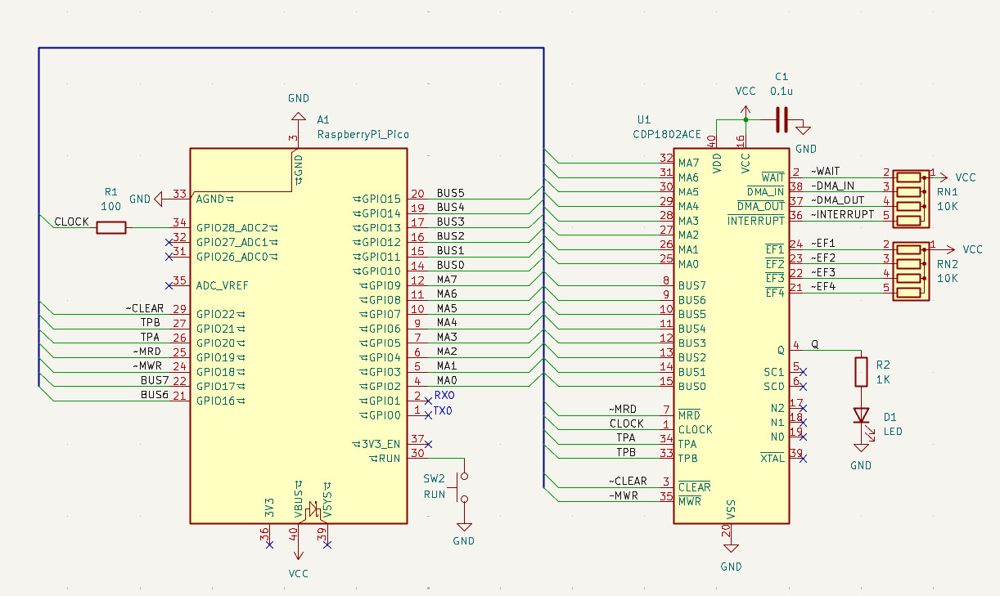

# Pico2ROMEmu で COSMACを動かしてみた

このブランチはPico2ROMEmuのコードを使用して、COSMACのROMエミュレータとして動かしてみた実験的なものです。

詳細はソースをご確認ください。

## 回路図

## ライセンス
本プロジェクトのソースコードはPico2ROMEmuのライセンスに従います。

## 免責事項
本ソフトウェアは現状のまま提供されます。いかなる損害についても作者は責任を負いません。

## 謝辞
kyo-ta04(DragonballEZ)さんをはじめとするPico2ROMEmuプロジェクトに関わる全ての方々
