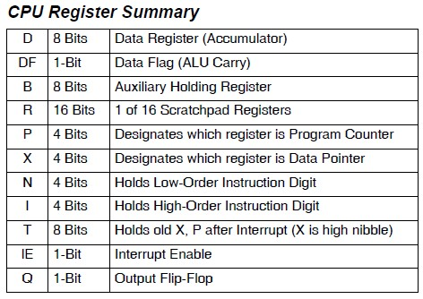
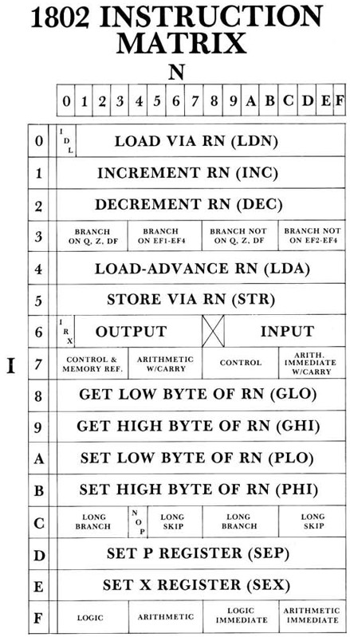

# Lチカの楽しみかた
リポジトリの[rom_basic_const.c](../rom_basic_const.c)にはLチカのサンプルプログラムが含まれています。
これを使って基本的なCOSMACのプログラミングを理解しましょう。

## ソースコード
ソースコードはrom_basic_const.cにコメントとして記載されていますが、blinkの部分だけで動くようにしたものを掲載しておきます。
```
0100-F8 40   START:  LDI #$40  ; Dレジスタに$40を入れる（点滅間隔のウェイトループ値）
0102-B4              PHI 4     ; R4の上位バイトにDレジスタの値を代入する
0103-CD              LSQ       ; Qが1だったら2バイトスキップする
0104-7B              SEQ       ; Qを1にする
0105-38              SKP       ; 次の命令を無条件でスキップする
0106-7A              REQ       ; Qを0にする
0107-24      LOOP1:  DEC 4     ; R4を1減算する
0108-84              GLO 4     ; DレジスタにR4の下位バイトを代入する
0109-3A 07           BNZ LOOP1 ; Dレジスタが0でなければLOOP1にジャンプ
010B-94              GHI 4     ; DレジスタにR4の上位バイトを代入する
010C-3A 07           BNZ LOOP1 ; Dレジスタが0でなければLOOP1にジャンプ
010E-30 00           BR  START ; 最初から繰り返す
```

## ハードウェアの準備
Q出力に抵抗とLEDを接続します。またはオプションのインジケーター回路を実装していればTXDのLEDを点滅することができます。

## ファームウェアの書き込み
1. Pico2のファームウェアをビルドする。
1. Pico2MEMEmuCosmacのPico2にUSBケーブルでPCを接続し、生成されたファームウェアを書き込みます。

## 点滅間隔を変えてみる
```
0100-F8 40   START:  LDI #$40  ; Dレジスタに$40を入れる（点滅間隔のウェイトループ値）
```
この40の値を変更して、ビルドして書き込んでみてください。点滅間隔が変化します。

## 最小限のプログラムにしてみる
サンプルプログラムでは点滅が肉眼でわかるようにウェイトループが入っていますが、最小限のプログラムにするとたった4バイトになります。
```
0000-7B      START:  SEQ       ; Qを1にする
0000-7A              REQ       ; Qを0にする
000E-30 00           BR  START ; 最初から繰り返す
```
このプログラムではLEDは点灯したままに見えますが、非常に高速で点滅している状態です。オシロスコープを接続するとパルスが出力されていることがわかります。

## COSMAC CPUの仕様
ここでCOSMAC CPUの仕様についてまとめておきます。

### レジスタの構成
Dレジスタは8ビットのアキュムレータです。R0-RFは16ビットの汎用レジスタでどのレジスタもプログラムカウンタやインデックスレジスタにできるユニークな構成です。またQレジスタで1ビットの出力ができます。スタックポインタはありません。汎用レジスタを使って実装することになります。



### 命令表
COSMAC CPUの命令セットは１枚の表にまとめることができます。




命令の詳細はデータシートを参照してください。

- [CDP1802A CMOS 8-Bit Microprocessors](https://www.renesas.com/ja/products/cdp1802a)


## アセンブラを使ってみる
少し大きなプログラムに取り組むにはアセンブラが必要になってきます。私が使っているのはSB-ASMというPythonで書かれたアセンブラです。Pythonさえ動けばどの環境でも使うことができます。詳細は公式サイトで確認してください。

- [The SB-Assembler 3](https://www.sbprojects.net/sbasm/)

SB-ASM用のソースコードは[blink1.asm](../blink1.asm)としてリポジトリに登録しています。
